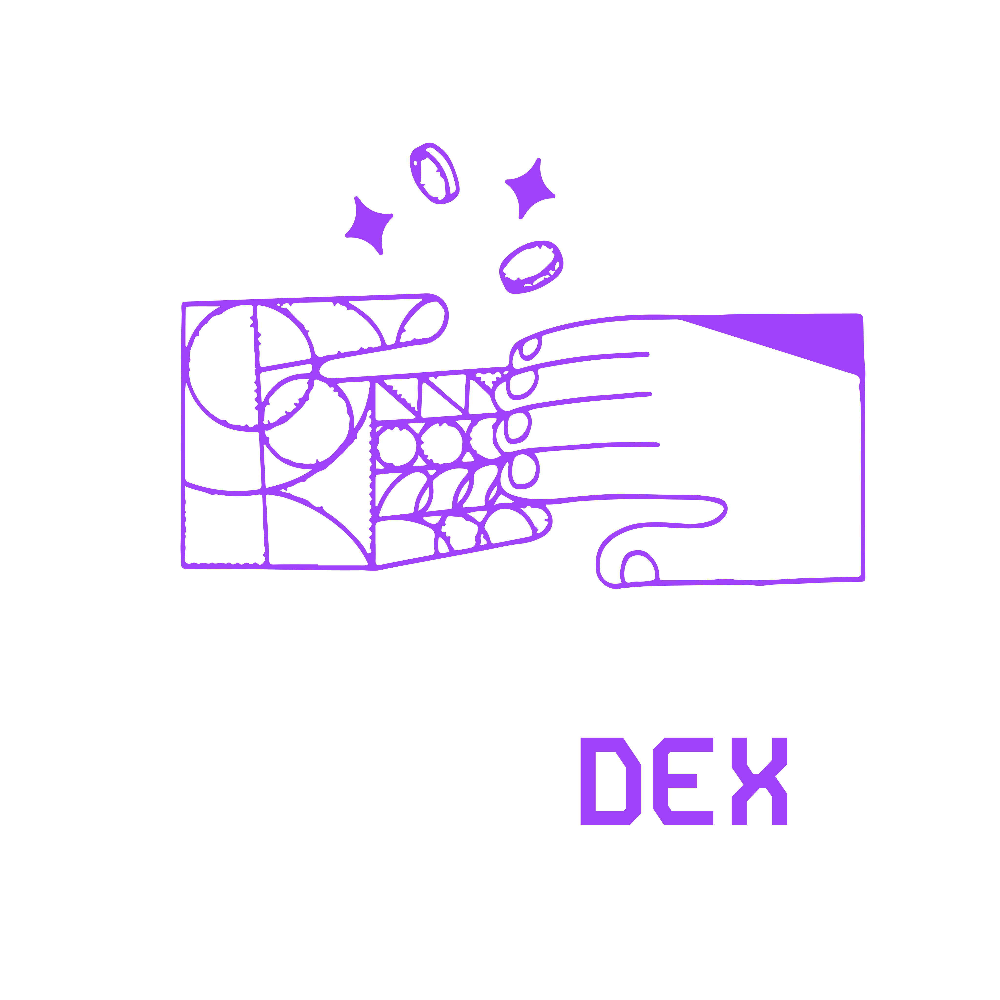

  

# 🏔️ Apex DEX Ecosystem

Welcome to the **Apex DEX** organization! This is a complete, full-stack decentralized exchange ecosystem built specifically for the **Sepolia Testnet**.

Apex DEX is designed to provide a high-performance, Uniswap V2-compatible trading experience with real-time analytics and advanced indexing.

---

## 🌐 Live Demo

You can try the live demo here:

👉 https://apex-dex.onrender.com/

> **Note:** The application is deployed on Render free-tier infrastructure.  
> Instances may enter sleep mode after inactivity, so the first request can take up to a minute while the backend services and indexer are starting up.

---

## 🗺️ Project Architecture & Repositories

The ecosystem is built with a modular approach, separating core logic, data indexing, and user interface.

### 📜 [apex-dex-contracts](https://github.com/Apex-DEX/apex-dex-contracts)

The heartbeat of the exchange. Core AMM protocol logic based on the proven Uniswap V2 architecture.

- **Features**: Factory, Router, Pair contracts, and custom ERC20 tokens for testing.
- **Tech Stack**: Solidity, Hardhat/Foundry.

### ⚡ [apex-dex-indexer](https://github.com/Apex-DEX/apex-dex-indexer)

A blazingly fast blockchain observer. It monitors Sepolia events in real-time to provide accurate pricing, volume, and liquidity data.

- **Features**: Event processing, pricing engine, TVL/APR calculations.
- **Tech Stack**: Go, PostgreSQL, Redis.

### ⚙️ [apex-dex-backend](https://github.com/Apex-DEX/apex-dex-backend)

The orchestration layer. It serves the indexed data to the frontend through a robust API.

- **Features**: REST API, data aggregation, caching strategies.
- **Tech Stack**: NestJS, TypeORM, Redis.

### 📱 [apex-dex-interface](https://github.com/Apex-DEX/apex-dex-interface)

A premium, modern trading interface. Built with a focus on UX/UI and performance.

- **Features**: Swap, Liquidity management, real-time charts, FSD architecture.
- **Tech Stack**: React, React Router 7, Tailwind CSS, TanStack Query.

### 📚 [apex-dex-docs](https://github.com/Apex-DEX/apex-dex-docs)

Comprehensive documentation covering architecture, deployment guides, and API references.

---

## 🌐 Network Information

All components are fully integrated and deployed on the **Ethereum Sepolia Testnet**.

| Contract        | Address                                                                                                                         |
| :-------------- | :------------------------------------------------------------------------------------------------------------------------------ |
| **ApexFactory** | [`0xC2E54EF993bD64c1e8c46d4d1695bEeA012d4DFD`](https://sepolia.etherscan.io/address/0xC2E54EF993bD64c1e8c46d4d1695bEeA012d4DFD) |
| **ApexRouter**  | [`0xf1026084F75375070e71442387896CA1314bC6e0`](https://sepolia.etherscan.io/address/0xf1026084F75375070e71442387896CA1314bC6e0) |

---

## 📖 Educational & Open Source Project

Apex DEX is a **non-commercial educational project** created for learning, experimentation, and portfolio demonstration purposes.

The project is fully open source, and you are free to explore, study, reuse, modify, or adapt the code for your own projects and learning needs.

The goal of this ecosystem is to demonstrate modern decentralized exchange architecture, indexing pipelines, backend orchestration, and frontend engineering practices in a real-world environment.

---

## 👨‍💻 Author

This entire ecosystem was architected and developed by **[taranvd](https://github.com/taranvd)**.

Feel free to explore the code, open issues, or contribute to the project!

---

  
  
  
  

